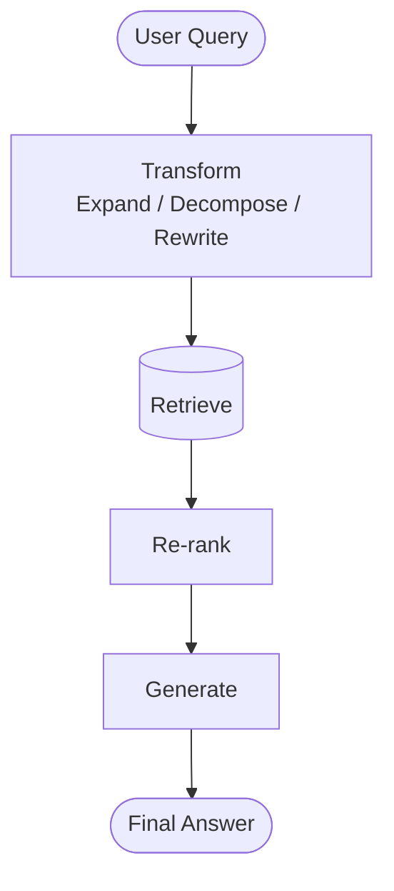
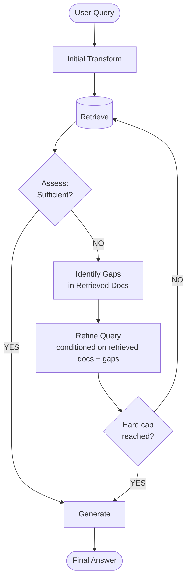
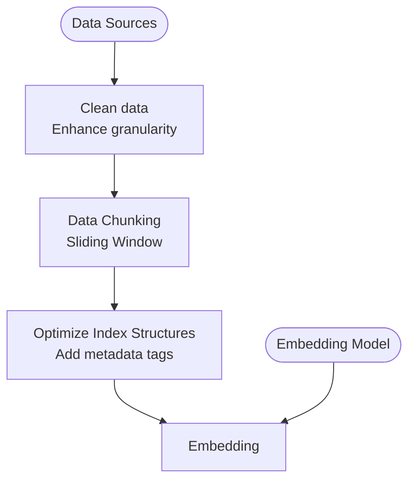

#Q1

The position of the text within the document can add valuable information. Chunks get sorted into different classes based on their layout. This detection process adds extra context and helps with interpretability. After tokenization, when machine learning methods create a dependency tree, the model can more easily discern dependencies if the chunks are focused around specific tokens. Too many tokens create a more complex tree, while too few might result in most words getting dropped as stop words. Preprocessing cost is higher, as this does require parsing the pdf into a classification model during the chunking process. Proper organization of information helps with retrieval, making it faster and keeping related information together. 

#Q2

Template based chunking does a good job for highly structured documents because following a structure rather than interpreting the documents semantically is less computationally consuming and saves preprocessing time. However, loosely structured corpora fail to follow any discernable templates. This would result in chunks that are potentially nonsensical and difficult to interpret later when dependency parsing. For this reason, embedded-driven semantic segmentation is more efficient here. 

#Q3

Vector-only and Lexical-only retrieval architectures optimize for different cases. Lexical search is more efficient but lacks flexibility. Additionally, the keyword matching of lexical searching is more precise but sometimes important context is lost. Vector search retains context and therefore is better at interpreting concepts, but is often more computationally expensive. If an exact match is needed, such as in important medical or legal cases, lexical search will retain precision, whereas vector search might confuse similar concepts, since it looks for encoded context. However, if you are using more general language rather than precise terminology, vector search works better. Lexical search might miss that a search for “pet” would include “dog”, but vector search is more likely to maintain that correlation. 

Using a hybrid architecture can help with both types of documents, however, re-ranking adds important context from multiple sources to give the most comprehensive answer. The BM score and lexical matching return information that matches most closely to the query, but important information with a lower matching score can be missed using these methods. Re-ranking helps retrieve such information. If the query and the correct answer do not match well, hybrid architecture has trouble making the connection. This is when the query itself has a logical fallacy or the subject of the query is only vaguely related to the information actually needed to successfully answer the query. This is because re-ranking adds extra conditional logic that compares multiple data sources with the query, assigning them an index of relevency to the query. They are then sorted, with the most relevant at the top. Without rerank, RAGFlow uses weighted keyword similarity combined with weighted vector cosine similarity. If a rerank model is selected, weighted keyword similarity will be combined with weighted vector reranking score.

#Q4

A multi-stage pipeline starts with candidate generation using ANN before going into re-ranking to optimize precision. The ANN by itself has a latency/recall tradeoff. In the pipeline, using a low latency ANN search can make the process more efficient as the re-ranking can focus on precision of the results. Query refinement is a final check to help with optimizing the results in a way the LLM better understands. This can also recover missed candidates that a single ANN would miss otherwise. However, it can also create a cascading error if the initial generation and re-ranking is far off. The refinement can veer off topic and lead to an answer further and further away from the desired result. 

#Q5

Elasticsearch-like hybrid store:
Recall for this method uses precise terminology. It is slower and takes longer to build the index but will preserve precision, which can be useful in legal or medical cases. 

Vector-native DB for Infinity:
If resources and time are limited, this is the best option. It works best on documents with uniform structure. LVQ compresses floating point into 8-bit integers when indexing, so it uses ¼ of the memory. Alternatively, there is the HnswRabitq method. This lacks complexity but is the fastest because it compresses information in a binary scalar where each floating point number is represented by 1 bit. The low fidelity makes it highly efficient but can lead to information loss. 

Graph-augmented store for Infinity:
This method is good at finding correlations and patterns between multiple subjects. It works well when multiple sources and databases need to be referenced and compared. This is possible because each vector has a scaled distance relative to its neighbors that is taken into account. Since it is more comprehensive, the latency depends on the complexity of the query.

#Q6

Queries can be written in a way that is outside of the scope of the LLM’s database. If there is terminology that escapes the vocabulary of the LLM or if there are relevant points that the query fails to mention, it creates a gap in providing results. Iterative query refinement helps close these gaps. 

Without iteration, the pipeline is as follows:

The latency here is a fixed bound and therefore predictable. There are no safeguards for wrong answers, but failures aren’t propagated. 

With iterative query refinement (agent-driven)

Here, there is a dependency chain. It can recover from error on iteration, though wrong answers with high confidence are propagated forward. Alternatively, a loop take a long time and potentially, a hard cap causing early termination could lead to misinterpretation of a query. 

#Q7

|  | Dense Vector Space | Relational Schema | Knowledge Graph |
|---|---|---|---|
| **Compositional Reasoning** | Weak| Strong | Advanced |
| **Retrieval Explainability** | Low | High | High, easy to follow |

Using a dense vector space creates high-dimensional embeddings. This allows semantic similarity patterns to be detected. However, logic changes are not created, so the reasoning is basic. It is difficult to interpret the reasoning since it is based on similarity scores. 

Relation schema representation is more structured and works well for highly structured information. Data is arranged into a table and relationship and patterns are represented by shared keys. Compositional reasoning is more advanced since connections can be made between different elements of the table. SQL queries are fully auditable since you can follow path and keys. It takes extra effort on the interpreter since explanations are structural, not semantic.

Using a knowledge graph creates nodes (entities) and edges (relations). This allows multi-hop Q&A, as a single query can traverse the graph. Compositional reasoning is very advanced. It is easy to understand but explanation quality depends on edge label quality; poorly labeled or missing edges produce misleading or incomplete traces. 

#Q8

The sliding window allows for incremental indexing while neighboring context is perserved. Data cleaning methods and the chunking process creates schema normalization across sources. Allowing for different representations of data depending on the type of document is helpful here.

Processing data incrementally allows for strong consistency on data processing, but greatly slows throughput. Processing items in parallel allows for higher throughput (more items at once) which decreases time but the tradeoff is consistency.

#Q9

Vector memory is not very structured and difficult to interpret. It uses similarity score, but the fidelity and therefore accuracy can be changed. 

Structured memory stores tables using SQL and and easy to audit. Ground truth is easier to find and achieve. Logical correlations appear. 

Though episodic logs are not structured, it is good for temporal data and logical decisions can be reconstructed. It is good for understanding how one event can lead to another. 

#Q10

